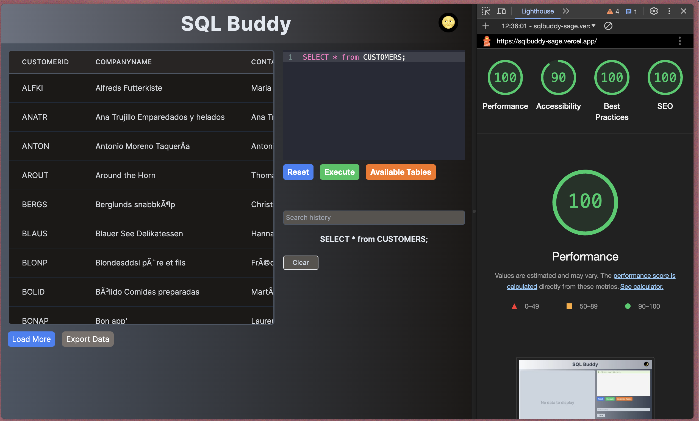
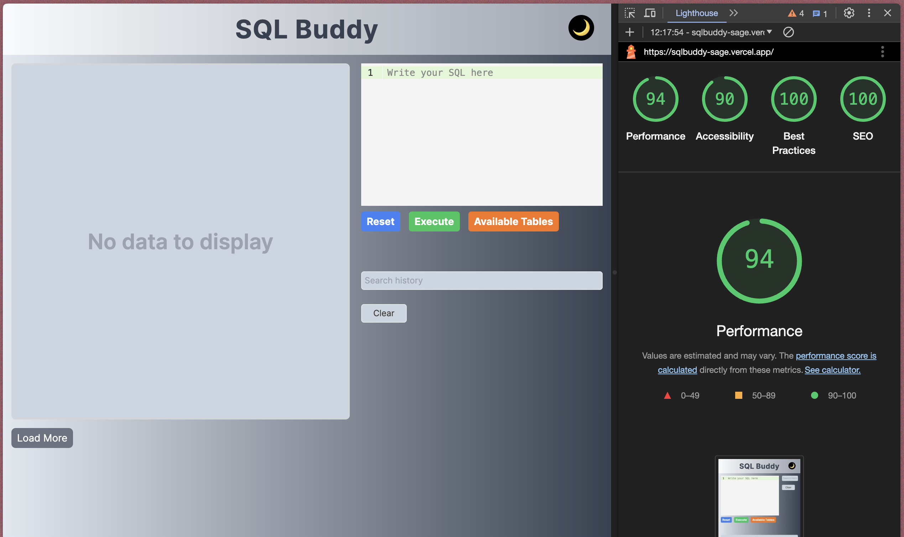

# SQL Buddy 🤖

## Overview 📚

**SQL Buddy** is a feature-rich SQL editor designed to streamline the process of writing and executing queries. While query validation is not yet implemented, users have the flexibility to run queries fetching data from available tables.

Upon executing a query, results are displayed in a table format. Users can easily clear the query input using the **Clear** button or access a list of available tables via the **Available Tables** button. To manage large datasets, only 15 rows are generated at a time, with the option to load more rows in increments of 15 by clicking **Load More**. Additionally, users can export the current dataset in CSV format using the **Export** button.

Successful queries are logged in the **History** section for easy access. Users can quickly retrieve previous queries by selecting them from the history list. The history can also be cleared using the **Clear** button. Furthermore, users have the option to customize the theme by toggling the theme button located in the top right corner. The website is fully responsive, ensuring a seamless experience across devices of all sizes.

## Example Queries 👾

1. `SELECT * FROM Customers`
2. `SELECT * FROM Categories`
3. `SELECT * FROM Orders;`

## Demo Video 👓

Checkout the demo video on YouTube

## Live Demo 👨‍💻

Explore the project on [GitHub](https://github.com/samarth4599/sqlbuddy) or try out the live demo: [SQL Buddy](https://sqlbuddy-sage.vercel.app/)

## Tech Stack 😎

- 
- 

## Dependencies ⚙️

- **_@uiw/react-codemirror_** - Code editor for writing queries.
- **_react-csv-downloader_** - Utility for downloading displayed data in CSV format.
- **_react-papaparse_** - Library for parsing CSV data from APIs.
- **_react-toastify_** - Toast notifications for displaying error and info messages.
- **_zustand_** - Lightweight state management solution.
- **_husky_** - Git hooks for pre-commit actions.

## Page Load Time ⏱

### Website Performance

### Mobile Performance

## Optimization Steps 🥷

- Utilized Lighthouse DevTools Extension to identify performance issues and implement suggested fixes.
- Leveraged React hooks (memo, useMemo, useCallback) to minimize unnecessary re-renders and optimize performance.
